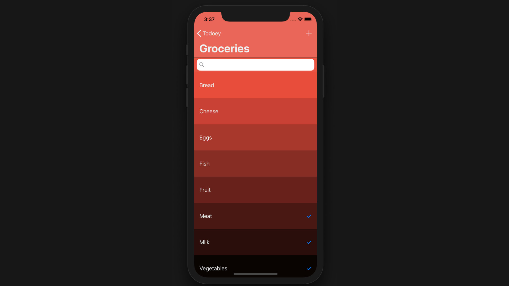

[Github Repo](https://github.com/shaunyap/Todoey)

Todoey is a Todo app for iOS, and was done as part of the [iOS App Development Bootcamp on Udemy](https://www.udemy.com/ios-12-app-development-bootcamp/). It ties together a whole slew of Swift concepts to create a beautiful App. Here is what I've learned making this app.

### Persisting data using Core Data vs Realm
One of the basic but key needs of a Todo app is to, well, store your todos. This means what you've written has to be saved to be viewed later and this data has to be stored somewhere.

Data was first persisted using a plist, before the instructor explained that plists aren't a good place for it in this case. The reason is that plists load in their entirety when the app starts. This means that as the data grows, the app boot process gets gradually more sluggish which makes for a poor user experience.

The data storage and retrieval functions were then created in Core Data. It was an important concept to cover and worked great albeit after strugging a bit with the complexities like NSPredicates.

Finally, we rewrote this using the open-sourced [Realm.io](https://realm.io/). I was surprised to find that it has been [tested to perform faster than SQLite and Core Data](https://dzone.com/articles/how-realm-is-better-as-compared-to-sqlite) while being much easier to understand and write than Core Data. 

Here is an example of adding a new item to be persisted by Core Data:

You first need to define the context, as well as a saveItems method
```
let context = (UIApplication.shared.delegate as! AppDelegate).persistentContainer.viewContext

func saveItems() {
	do {
		try context.save()
	} catch {
		print("error saving context. \(error)")
	}
	self.tableView.reloadData()
}
```
Then in order to add the item when you click on the Add button in the UIAlert, you create a newItem object and put all the information as key-value pairs before pushing it into an itemArray to be saved:
```
            let newItem = Item(context: self.context)
            newItem.title = textField.text!
            newItem.done = false
            newItem.parentCategory = self.selectedCategory
            self.itemArray.append(newItem)

            self.saveItems()
```      
In Realm, however, after you define Realm at the start with a simple
```
let realm = try! Realm()
```
All you need to do is to call realm.write with the item object, and wrap the entire thing in a do-catch block. You not only save a couple lines of code, but also make it esier to understand. 
```
            if let currentCategory = self.selectedCategory {
                do {
                    try self.realm.write{
                        let newItem = Item()
                        newItem.title = textField.text!
                        newItem.dateCreated = Date()
                        currentCategory.items.append(newItem)
                    }
                } catch {
                    print("error saving item. \(error)")
                }
            }
            self.tableView.reloadData()
```

Realm is definitely a platform worth looking deeper into as it supports not just Swift, but JavaScript, Java and other technologies that prevelant in cross-platform use.

### Modeling data categories
One of the cooler things about this app that many other todo tutorials teach is creating a data model. This allows the app to have categories that todos can be organized into, much like pretty much any commercial todo app.

In Todoey, each todo belongs to a single category, and each category can have multiple todo items. Furthermore, Todo items also have a 'done' property that can be either true or false. Touching or swiping the task toggles the property. 

### App Delegates
The app delegate is a fundemental iOS concept that was new to me doing this project. It means that an object is able to take on a task that the app needs doing. 

A real life example of this concept is getting a meal. While you can prepare and cook the meal on your own, delegates might be a meal delivery service, or a kind family member - both get the task done for you. They handle the details, while you know you're getting a meal.

In this app, I made my view controllers the delegate for various things, like handling segues between screens and populating the TableView.

### Miscellaneous, Fun stuff
I also got to implement a bunch of fun stuff, like using the Chameleon framework to generate random colors for categories, and then using it to create a color gradient for the tasks in the category.

It was also interesting to implement [SwipeCellKit](https://github.com/SwipeCellKit/SwipeCellKit) - a library to create swipe gestures like the one you see in Mail.