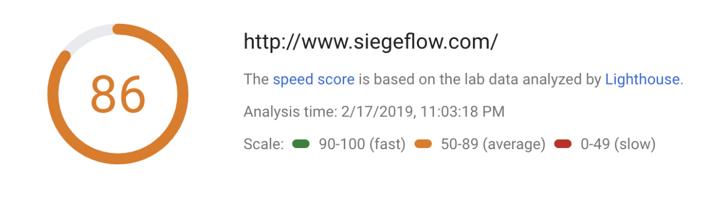
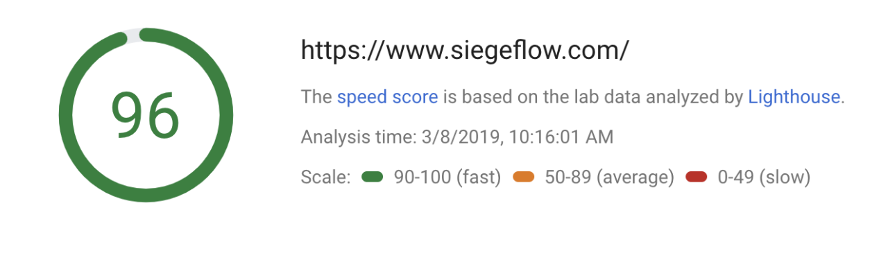

#### Laying down the infrastructure the future of siegeflow will be built on 

A couple of weeks ago I wrote about [moving siegeflow.com from WordPress to Gatsby](https://www.siegeflow.com/blog/moving-from-wordpress-to-gatsbyjs). I shared some of my motivations and the overall experience of working in Gatsby, so I thought I’d give an update on its Quality of Life effects so far.

## Performance Improvements
Coming into this, I was proud of my WordPress site. Over the last couple of years, I’ve worked hard to improve performance, making speed improvements, hosting it on a CDN, getting HTTPS up and running. I even spent some time manually optimizing images for the site. It had a decent, but not great PageSpeed score, so I was keen to see how Gatsby might affect it.

Since I followed the best practices listed in their documents, everything worked out quite nicely out of the box. Just load up the modules I need, and it all went swell with resizing images to their optimal sizes, minifying JavaScript and CSS. Deploying on Netlify also gave pre-configured HTTPS, instead of having to configure it myself as I did the last time round on my WP site.

Looking at areas of potential improvements, I’m embarrassed to admit that the one image that it flags, was one that I hardcoded myself. Having said that though, going from a score of 86 to 96 without doing any performance-specific work is a great start!

Easy Gains!

## No longer needing web hosting
One of the side benefits of moving to Gatsby is now being able to host it on Netlify’s free tier and connecting it to my domain. The CI/CD approach of pushing changes to Github and having it automatically deployed to the site is terrific. The cherry on top is that I no longer need to pay the US$70ish for hosting each year. Probably not the best use of time if the goal was to save money, but still! 

## Learning a stack of new technologies and concepts
By far the biggest win from the project is that I not only got some reps with writing React.js but also learned a bunch of new concepts and technologies. For this project, I went back to basics with React and SASS.

#### Back to basics with React and SASS
For the React part of the project, I focused it on correctly implementing function and class components, as well as not over-doing it with components as I did in a [previous project](https://www.siegeflow.com/work/chatq). I also managed to have a play around with implementing the ComponentDidMount() lifecycle method to do a couple of things. By far the most important of the two was to implement the fade in effect of the siegeflow logo after scrolling down some hundred pixels so that rendering of the main page is prioritized. The other is a fun easter egg - click on ‘Hello World!’ on the homepage for a fun surprise.

For the styling of the site, I decided early on that I was not going to use a library like Bootstrap, Foundation or Semantic UI, as I’ve already had experience implementing those. So instead, I implemented the responsive design from scratch using Flexbox. In hindsight, I should probably have at least tried to implement it in CSS Grid, but I guess that might be a fun project for the future.

#### Gatsby, GraphQL and Static Site Generators
The other benefit I took away the concept of Static Site Generators. I’ve previously heard the term but had the preconceived notion that it was only for simple informational sites. However, with frameworks like Gatsby or Hugo, all this means is that the files are rendered at build-time, not run-time like WordPress. Tons of dynamic features can be added such as those found in Single Page Apps. It was a conceptual shift for me, and I’m all the better for it.

Getting my hands dirty with GraphQL was also exciting. While I can’t say I fully understand the nuances and differences in practice between working on GraphQL and a REST API, it does seem like it can be a bit simpler to implement, but it is something I need to look into further.

## Was it worth the effort? Totally.
All in all, it took me about 15 hours to code ((time tracking comes in handy like that)), create content, and deploy. If you asked me if it was worth it, I’d probably say the performance gains and savings, while great, would not have been justified in and of themselves. However, being able to have done it, as well as being able to take these learnings and expand my knowledge boundary made the exercise more than worthwhile.