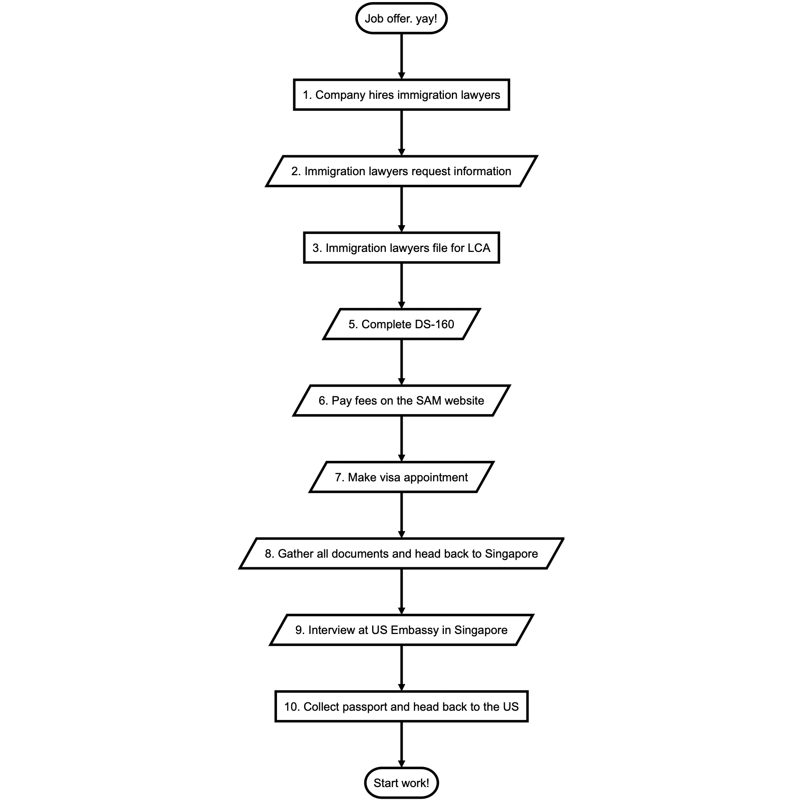

---

path: "/blog/applying-for-h1b1"
date: "2019-06-14"
title: Getting a H1-B1 visa to work in the US
category: "blog"
thumbnail: "./thumbnail.jpg"
tags: [Immigration things]

---

As I write this post, I am in the plane headed back to the United States to start my new job after getting a H-1B1 visa in Singapore. I could never have found my way through the process had it not for the people who had done this before and shared their experience in the following posts:

- [u/swyx](https://www.reddit.com/r/singapore/comments/7nflav/h1b1_visa_ama/)
- [christinang89](https://christinang89.quora.com/5-steps-to-file-for-H-1B1-Singapore-Visa-yourself)
- [hguochen](http://blog.hguochen.com/guide/2014/11/22/My-H1B1-experience/)

Having said that, since there have been some recent-ish changes since the last post, I hope that writing about my experience will help guide the way for other people the same way these have helped me. This is my **personal** experience with the H-1B1 (Singapore) visa, so caveat emptor.

### Background - the context of this post
It is worth mentioning that I am Singaporean. I was already in the US for ~3 months on a H4 visa (my wife got transferred by her employer) when I was offered a role. There used to be a document you could get called the Employment Authorization Document (EAD), but it has since been curtailed somewhat.

I will be working for a software company in a non-technical role, so while a lot of people are in technical/development capacities, it is indeed possible. I have a bachelors in business from SMU.

### What is a H-1B1, anyway?
The H-1B1 is a special class of the H-1B visa which allows foreigners to work in the United States. It is available to Singaporeans and Chileans as part of their respective free trade agreements with the United States. The Singapore version has an annual quota of 5,400, a number that has never been reached since its inception.

There are a few key differences between the classic H-1B and H-1B1, but [Wikipedia covers it comprehensively](https://en.wikipedia.org/wiki/H-1B1_visa#Differences_with_H-1B_program).

### The process I went through
Here is an overview of the process I went through. Your mileage may vary as I completed steps 1 through 8 online in the US with the help of immigration lawyers provided by my new employer.

### Immigration Lawyers and LCA
My employer hired immigration lawyers to help with the filing the LCA and putting together a packet. They requested some basic info from me (passport information, degree etc) and FedExed it to me when it was done after a week.

### DS-160
The system to get this filed is a bit of an old and janky which frequently gave me timeouts, but with a bit of grit I managed to get through it. The confirmation page and application number is important for future steps. It took a couple of hours of mostly wrestling the system and wrangling documents (some of which I already had from applying for the H4 previously)

### Make a payment 
The next step is to pay for the visa application. The cost fluctuates with exchange rates, but it was in the ~S$270 range.
- Unintuitively, a deposit slip needs to be generated at the [bottom of the payment options page](http://www.ustraveldocs.com/sg/sg-niv-paymentinfo.asp) to get the CGI Number that payment can be made to. 
- There are several options, in the past Standard Chartered bank used to be an option, but they’ve since discontinued this. I used the SAM Website since I did this while overseas. I needed to create an account for the website, but once that was done it was rather straightfoward.

### You can now make an appointment
With the above information, an appointment can finally be made at the US Embassy in Singapore at ustraveldocs. It’s kinda better than the DS160 site, so I decided that was a nett positive.

The only thing that people seem to have been stuck with is the ‘receipt number’. Intuitively, you’d think to put in the MRV receipt, but you get an error message. Thankfully for the internet, people have found that by putting in the ‘cheat code’ **ABC0000000000** it works fine. I can confirm this.
- Appointments are available in the mornings on Tuesdays and Thursdays, with some days blocked out. There was a full week that did not have appointments for me. I recommend booking an early appointment for reasons that will become obvious below.
- I selected to collect my passport from the courier company Aramex at near Changi Business Park but you can also choose to get it from their Chinatown branch or have it couriered to you. I had a good experience picking it up as their office is really small so it was fast. 

### The visa interview
I scheduled my visa interview at the US Embassy in Singapore, booked my flight and turned up about 30 minutes before my appointment. Here is what should happen in theory:
- Join the line at the embassy entrance
- A staffer would check that the required documents while you wait, and advise that large bags or devices larger than a mobile phone are put into a storage locker (I believe it’s S$2 in coins to use it)
- Security check, just the standard stuff - metal detector, check in your phone and it’s off into the visa interview hall
- There are three counters, the first for them to collect your passport and photo, the second for finger printing and finally the third for an over the counter interview
- If successful, the person at the third counter will get your passport stamped. They typically advise one full week for this.

### Practical tips for the interview
The critical documents needed:
1. Passport with sufficient validity
2. A printed appointment confirmation
3. DS-160 confirmation
4. LCA
5. A US passport photo (square and taken fairly recently, although there is a photo machine at the visa interview hall you can use for S$10)

The supporting documents I brought were:
1. The document packet from my lawyers, which includes a job offer and the official document they filed
2. Original degree and transcript
3. Proof of non-intent - HDB ownership documents
4. Marriage certificate
5. Resume

In my case, because I did not have the LCA (it is not on the list of required things they tell you to bring) initially, they gave me a note after the second counter that said I could turn up with this any weekday at 10.30am with the missing document(s) to continue the process. Thankfully my interview was early, so I had sufficient time to go to the nearest business center (Hotel Jen at Tanglin Mall), get it printed and dashed back.

My second time around, they thanked me for coming back, asked a few simple questions about my job and if I knew my rights, which was in a pamphlet they hand to you to read while you queue.

They took a cursory look at my supportinf documents and said my H-1B1 was approved, and kept my passport.

### Passport collection
The same website I used to make an appointment also tracks the status of the passport. They sent an email and SMS about it as well, but the website was the first to be updated when my passport was ready for collection. As mentioned above, I chose to collect my passport at Aramex, and so the day it was reflected as ready, I headed down with my NRIC and got that done as quickly as I could have reasonably hope.

It is now two days after collection and I’m en route back home to the United States to start my new job. I will try to answer questions on reddit where I can. Hopefully this can be as helpful to others as the other posts have been for me.