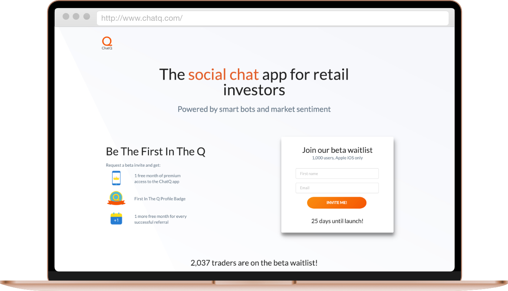
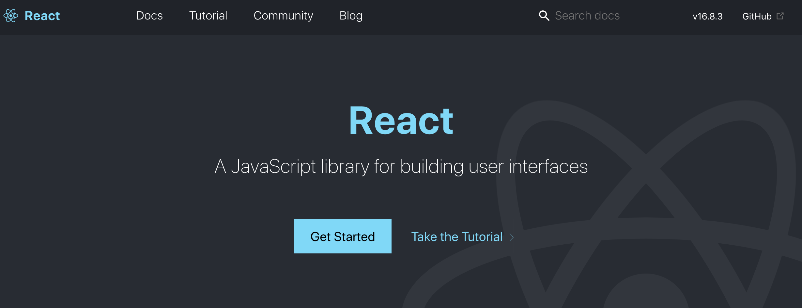
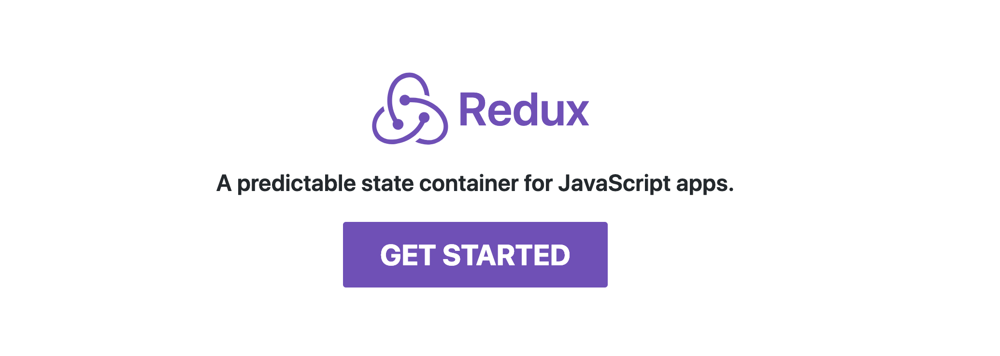
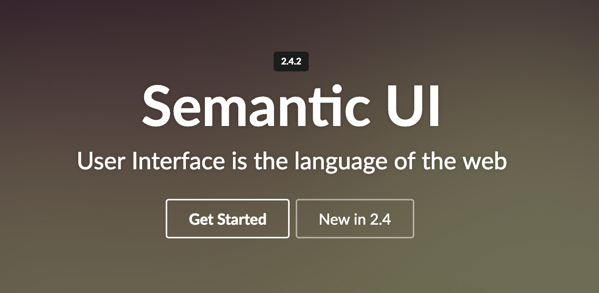
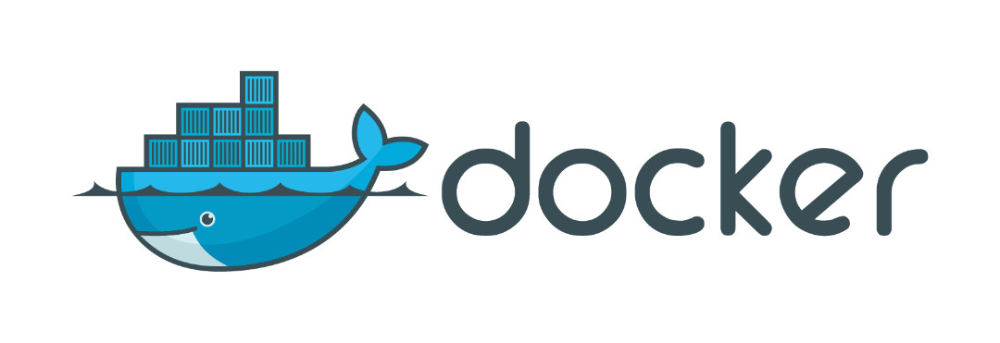

#### [Github Page](https://github.com/shaunyap/chatq-prelaunch)

Chat Q is a social chat app that allows investors to get insight from reputable community members.

I built a web app as a proof of concept to generate unique referral URLs for their beta testers when they signed up, and rewarding them accordingly for each referral they made.

It was built using React.js and Next.js and used the Viral Loop API to track and reward each individual referral.

Here's what I used to create the webapp.

### [React.js](https://reactjs.org/)

The web app was written in React.js. Reusable components made it easy to separate out the different front-end parts and made the source files readable and clear. 

React's built-in support for state management allowed for data to be passed down into the right components in a manner that was easy to demonstrate and explain to the wider team.

### [Redux.js](https://redux.js.org/)

Redux was used to manage states and separate out the API call functions into an actions file, where they could be called (or dispatched, in Redux parlence) as needed.

This was handy in several places. For example, the "Thank You" page allowed returning visitors to see how many referrals they had made using their referral code. Loading the page, the action "getReferralCount()" was dispatched. The function returned the number of referrals as well as the total number of free months, which was then displayed on the page.

### [Next.js](https://nextjs.org/)

Next.js was used to render the webapp on the server, as well as to handle the routing. As this project was done as a proof of concept, Next.js made quick and easy to deploy.

### [Axios](https://github.com/axios/axios)
Axios is the go-to method to make http requests in Node. It abstracts away a lot of complexity so much so it's almost trivially easy to make an async GET or PUT request.

These calls were made in the Redux actions to either register someone on Viral Loops using their API, or to pull pertinent information such as their referral code, or number of referrals.

### [Viral Loops](https://viral-loops.com/)

Viral Loops is a marketing SaaS which we used to handle the referral back-end. While they had a built-in solution for running the referrals, it did not fit our needs to communicate the process to our users.

They were thus used as a back-end solution which could export the list of sign-ups and referrals to load into the client's email platform.

### [Semantic UI](https://semantic-ui.com/)

Semantic UI was something new I tried for this project. It is a fully fledged UI framework that allowed me to customize the front-end to fit Chat Q's branding.

### [Docker](https://www.docker.com/)

The app was containerized in Docker, as the team wanted to decide where to deploy the app later. This made it easy for me to demo it on a cloud VPS, but also deliver it to the client. 